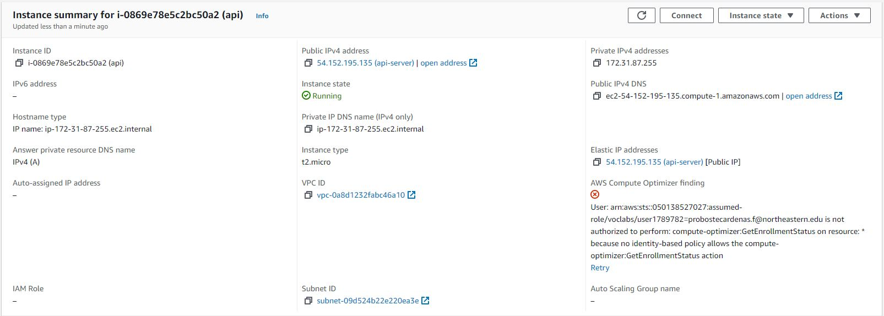
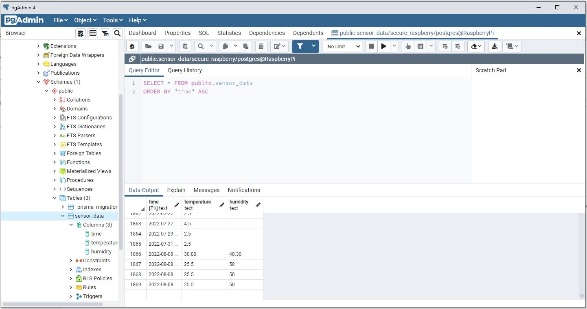

# secure-raspberry-pi
IoT secure connection to the cloud + data sniffing test.

___
###Evaluate requirement specs

The sensor.py python script obtains the data (current temperature, temperature, and humidity) from the raspberry pi.
~~~ python 
        current_time = time.strftime("%H:%M:%S", t)
        temperature_c = str.format("%.2f" % temp)
        humidity = str.format("%.2f" % h)

        data = {"time": current_time, "temperature": temperature_c, "humidity": humidity}
~~~

The data is then sent to the server continuously until the raspberry pi stops generating the required information. When that occurs, the script terminates.

The data is then transmitted into the server created in an AWS EC2 instance. The server is constantly "listening" for data being transmitted from the client (Raspberry Pi).

Within the same AWS account, a Postgresql database has been created to store the data transmitted from the client.

We are able to check that the dat is being transmitted and received independent of the AWS environment by setting-up the database in PgAdmin and verifying the activity within the database.

The secured connection is established between the client and server by generating the key-pair
___
###Unit testing

___
###Test for Security and Vulnerability

___
###System Integration

___
###UI/GUI or CLI