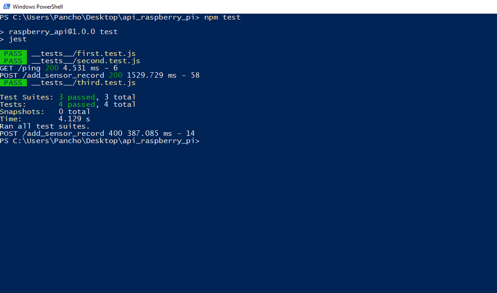

# secure-raspberry-pi
IoT secure connection to the cloud + data sniffing test.

The project was designed to obtain data (current temperature, temperature, and humidity) from a raspberry pi device (client). The objective is to transfer the data to a secured server. The server generates the key-pair that will be used between the client and the server. Once a secured connection is established between the client and the server, the data transferred is then uploaded/written into the database created in the server environment.

___
###Evaluate requirement specs

The initial step was to ensure that there is data generated from the raspberry pi device. For this phase of the project, a python script (sensor.py) was created to obtain the data from the raspberry pi - if any.
~~~ python 
        current_time = time.strftime("%H:%M:%S", t)
        temperature_c = str.format("%.2f" % temp)
        humidity = str.format("%.2f" % h)

        data = {"time": current_time, "temperature": temperature_c, "humidity": humidity}
        
        url = "https://ec2-54-152-195-135.compute-1.amazonaws.com:8800/add_sensor_record"
        requests.post(url, json=data, verify=False)
        time.sleep(5)
~~~

If there is no (more) data generated from the device or an error is encountered, the script terminates and so does the transmission to the server.

~~~ python
    except RuntimeError as error:
        print(error.args[0])
        time.sleep(2)
        continue
    except Exception as error:
        dhtDevice.exit()
        raise error
~~~

As long as there is data generated from the raspberry pi, it is transmitted to the server via the secured connection. The database is updated continuously since the server is constantly "listening" for data being transmitted from the client-side.

The server used in the project was created using the AWS EC2 environment. An instance was created in EC2 to act as the server and would host the database (using Postgresql) that will be updated with the data from the raspberry pi.

Within the same AWS account, a Postgresql database has been created to store the data transmitted from the client.

We are able to check that the data is being transmitted and received independent of the AWS environment by setting-up the database in PgAdmin and verifying the activity within the database.

As per the screenshot, the table (sensor_data) is continually updated from the data generated with the raspberry pi device. 
___
###Unit testing

As part of the unit testing, we can check whether there are data objects created by the raspberry pi device (client). 

~~~ python
    dhtDevice = adafruit_dht.DHT22(board.D4)
    assert dhtDevice is not None
    assert board.D4 is not None
~~~
If there is no object created, then, an Exception is generated in the python script.

For unit testing in the server, several tests were created.
~~~ JavaScript
test("It adds two numbers", () => {
    expect(1 + 1).toBe(2);
  });
~~~

~~~ JavaScript
const request = require('supertest')
const imports = require('../app')
const app = imports.app

describe("GET / ", () => {
    test("It should respond with Pong", async () => {
      const response = await request(app).get("/ping");
      expect(response.body).toEqual("pong");
      expect(response.statusCode).toBe(200);
    });
  });
~~~

~~~ JavaScript
const request = require('supertest')
const imports = require('../app')
const app = imports.app

describe("POST / ", () => {
    test("It should respond with Bad Request Message", async () => {
      const response = await request(app).post("/add_sensor_record").send({
        "time": "2022-08-08 23:37:00",
        "temperature": "25.5",
        "humidity": "50"
      });
      expect(response.body).toEqual("Record at time 2022-08-08 23:37:00 inserted succesfully.");
      expect(response.statusCode).toBe(200);
    });
  });

describe("POST / ", () => {
    test("It should respond with Bad Request Message", async () => {
      const response = await request(app).post("/add_sensor_record").send({
        "time": "",
        "temperature": "25.5",
        "humidity": "50"
      });
      expect(response.body).toEqual("Bad request.");
      expect(response.statusCode).toBe(400);
    });
  });
~~~

___
###Test for Security and Vulnerability

___
###System Integration

___
###UI/GUI or CLI